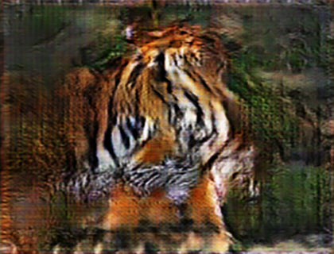

# ml-art-final2-amcda-anymlcandoart
ml-art-final2-amcda-anymlcandoart created by GitHub Classroom

Input image                |  Final fused Edge maps    |    Edge maps from side layers
:-------------------------:|:-------------------------:|:-------------------------:
  |   | 
  |   | 

- Final fused edge maps generated at 100, 500, 1k, 1.5k, 2k, 2.5k, 3k, 3.5k, 4k, 4.5k iterations.
